# 2020q3 Homework1 (quiz1)
###### tags: sysproc
contributed by < `a885566885566` >

[TOC]

## Code explaination
在這邊為方便理解， graph 新增與刪除connection時，
- 以紅色 arrow 代表在前一步中還存在，但是這一步被刪除的 connection
- 以綠色 arrow 代表在這一步被新增的 connection

### Func1: add_entry()

- 目標：於 list 末端插入一個新node。
- 原始程式碼：
```cpp=
void add_entry(node_t **head, int new_value)
{
    node_t **indirect = head;

    node_t *new_node = malloc(sizeof(node_t));
    new_node->value = new_value;
    new_node->next = NULL;

    assert(new_node);
    while (*indirect)
        indirect = &(*indirect)->next;
    *indirect = new_node;
}
```

- Step1: 利用 `indirect` 指向 `head` ，其中 `head` 是 pointer of pointer ，紀錄第一個 node 所在之 address ，其中 head 可以是指向任意 `(node 的 pointer) 的 pointer` 。
- Step2: malloc 新的記憶體空間，並為其賦值。因此第9行的目的為檢查 malloc 是否成功，若不成功則回報錯誤。

```cpp=5
node_t *new_node = malloc(sizeof(node_t));
new_node->value = new_value;
new_node->next = NULL;
```
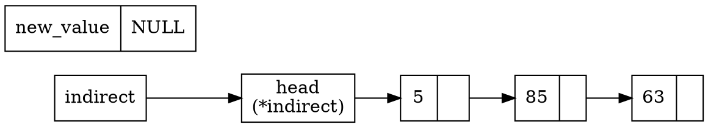

- Step3: 利用 for 迴圈直到最後一個 node (因為最後一個 node 的 next 指向 NULL)

```cpp=10
while (*indirect)
    indirect = &(*indirect)->next;
```

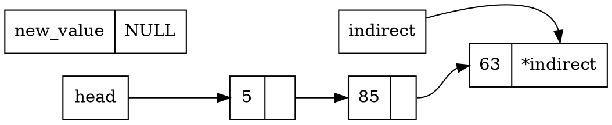

- Step4: 此時 indirect 為指向 `((最後一個 node) 的 next) 的 pointer` ，因此修改 *indirect 的值將`使最後一個 node 的next` 指向 new_node 的address

```cpp=12
*indirect = new_node;
```

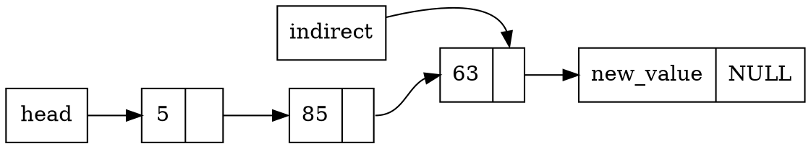

### Func2: find_entry()

- 目標：list中尋找特定 value 的 node ，若沒有 node 符合則回傳 NULL。
- 原始程式碼：
```cpp=
node_t *find_entry(node_t *head, int value)
{
    node_t *current = head;
    for (; current && current->value != value; current = current->next)
        /* interate */;
    return current;
}
```
- Step1: 利用 `current` 紀錄目前 `head` ，其中 `head` 可以是list node中的任何一個 node 。
- Step2: 只要目前 node 還存在(還沒到尾巴)，並且目前 node 不是目標，就繼續往下一個 node 移動。
```cpp=4
for (; current && current->value != value; current = current->next)
        /* interate */;
```
current 指向 node 5 ，但因為與之不符，繼續往下一個點。
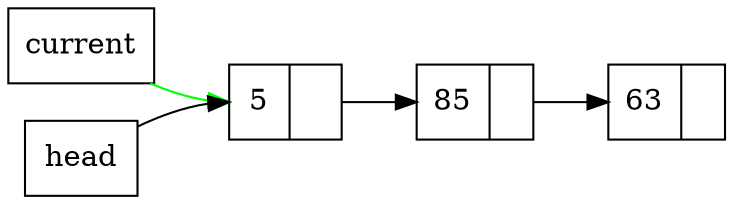
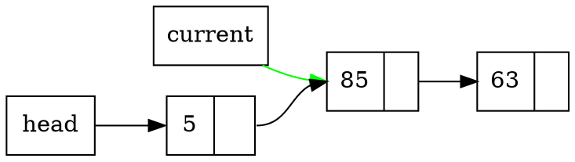
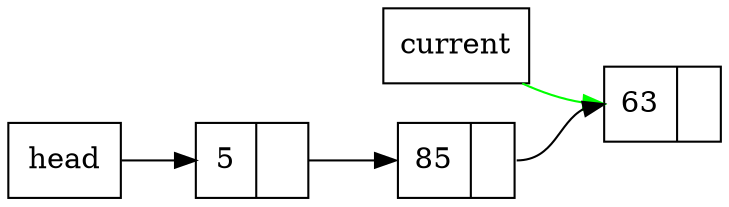
假設該 node 值相同，則回傳 current 目前指向之 pointer ，即為 node 63 的 address 。

:::warning
可以觀察到 
- `add_entry()` 使用 pointer of pointer of node ，`add_entry()` 是改變一個 next 的指向，其操作對象是一個 pointer ，因此用 pointer of pointer 。
- `find_entry()` 使用 pointer of node ， `find_entry()` 是尋找一個 node 的 value ，其操作對象是一個 node 因此使用 pointer of node.
:::

### Func3: remove_entry()

- 目標：list中尋找特定 node ，若找到則釋放其記憶體。
- 原始程式碼：
```cpp=
void remove_entry(node_t **head, node_t *entry)
{
    node_t **indirect = head;

    while ((*indirect) != entry)
        indirect = &(*indirect)->next;

    *indirect = entry->next;
    free(entry);
}
```
- Step1: 利用 `indirect` 指向 `head` ，其中 `head` 是 pointer of pointer ，紀錄第一個 node 所在之 address ，其中 head 可以是指向任意 `(node 的 pointer) 的 pointer` 。
- Step2: 尋找符合的 `entry address` 
```cpp=5
while ((*indirect) != entry)
    indirect = &(*indirect)->next;
```
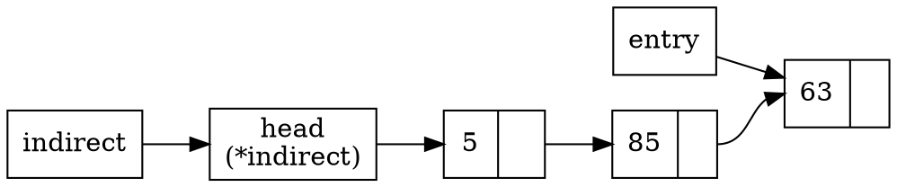
`(indirect 指向的 next) 的 address` 與 `entry 所指向的 address` 不相符，因此繼續往下走。
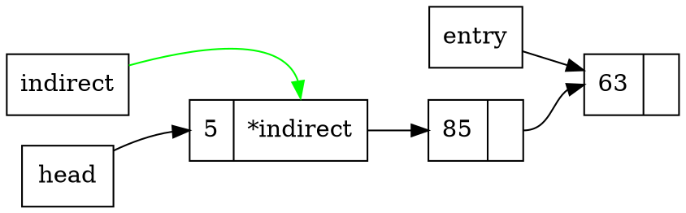
`(indirect 指向的 next) 的 address` 與 `entry 所指向的 address` 相符，皆為 node 63 因此離開迴圈。
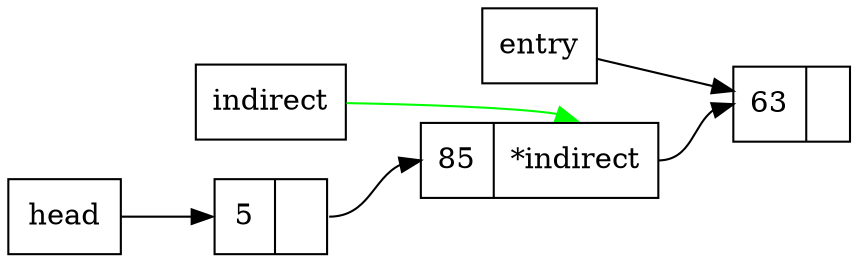
- Step3: 接下來把 `entry 的 next`接回指向 entry 的 next，也就是 node 85 的next，以免 node 57 及其後輩們無家可歸。
```cpp=8
*indirect = entry->next;
```
`*indirect` 表示 node 85 的 next ，應指向 entry 原本的 next。
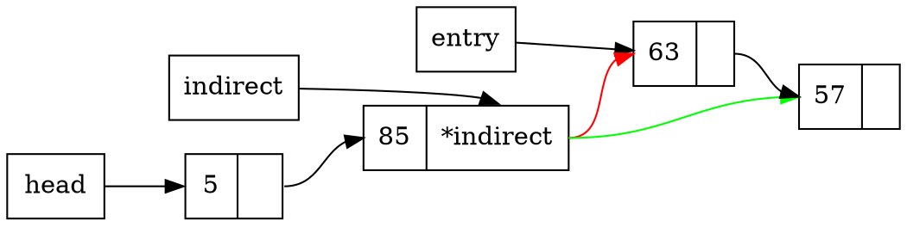
- Step4: 最後刪除 `entry` 指向的address，也就是 node 63
```cpp=9
free(entry);
```

### Func4: swap_pair()

- 目標：兩兩節點互換，若總共偶數個節點則剛好交換，若總共奇數個節點則留下最後一個沒有互換。
- 原始程式碼：
```cpp=
node_t *swap_pair(node_t *head)
{
    for (node_t **node = &head; *node && (*node)->next; node = &(*node)->next->next) {
        node_t *tmp = *node;
        *node = (*node)->next;
        tmp->next = (*node)->next;
        (*node)->next = tmp;
    }
    return head;
}
```
- Step1: 因為要倆倆互換，所以一次要跳兩個點，跳之前要先檢查這兩個點是不是都還存在，否則就跳不過去了。

```cpp=3
for (node_t **node = &head; *node && (*node)->next; node = &(*node)->next->next)
```

- Step2: 將 node 順序互換，使用 tmp 節點暫存。
一開始長這樣：
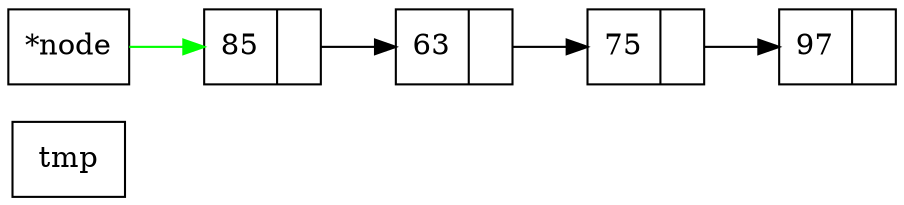
```cpp=4
node_t *tmp = *node;
*node = (*node)->next;
```
1. `*node` 為原本的head ，因此 `*tmp = *node` 將指向 node 85。
2. `(*node)` 為 node 85 的 address ，因此用`->`指向 next
3. 由於 node 是指向 head 的 `pointer of pointer` ，所以 `*node=` 實際上是對指向 node 85 的 head 重新賦值，在這邊就是重新指向 node 63 ，因為 node 85 的 next 為 node 63 (參考第二點所述)

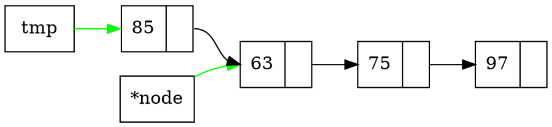
因為要讓 node 85 和 node 63 互換順序，因此 node 63 的 next 重新指向為 node 75
```cpp=6
tmp->next = (*node)->next;
```
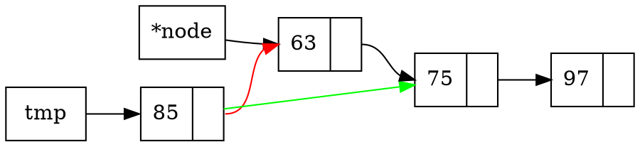
最後，把 node 63 的 next 接上 tmp ， tmp 為 Pointer of node，指向 node 85 ，便完成第一組互換。
```cpp=7
(*node)->next = tmp;
```
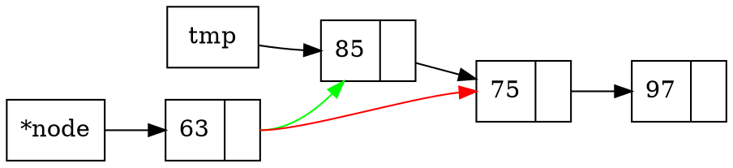
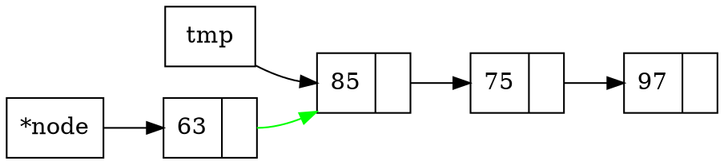
for 迴圈中，最後會更新 node ，將 node 變成指向目前 next next 的 pointer ，也就是 node 85 的 next 的 address ，而 `*node` 實則指向 node 75 。
```cpp=3
node = &(*node)->next->next)
```
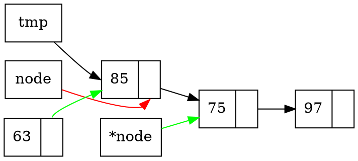
:::warning
- 注意，因為只有在一開始的時候 node 指向 head 因此只有第一次互換會變更 head 的內容，讓 head 變成 node 63 ，其他時候則是變更`其他 node 的 next` 。
- 總之，就是 node 會令原本指向`奇數 node` 的 `pointer of pointer` 變成指向`偶數 node` ，只是只有第一個是 head ，其他是 next
:::
### Func5: reverse()

- 目標：將 list 內所有 node 指向互換。
- 原始程式碼：
```cpp=
node_t *reverse(node_t *head)
{
    node_t *cursor = NULL;
    while (head) {
        node_t *next = head->next;
        head->next = cursor; cursor = head;
        head = next;
    }
    return cursor;
}
```
- Step1: 用迴圈方式，從第一個 node 逐漸換到最後一個 node。
用以下的 list 舉例
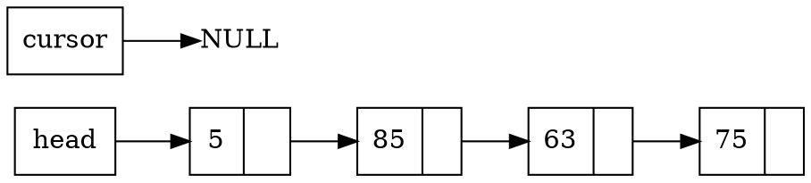

```cpp=5
node_t *next = head->next; cursor = head;
```

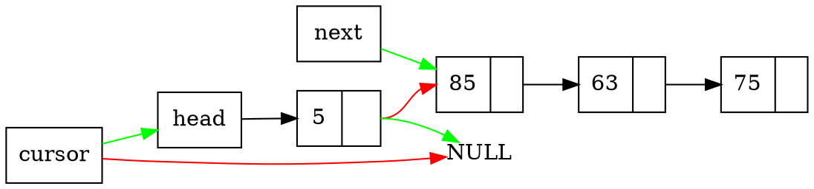
拿掉已經刪除的線
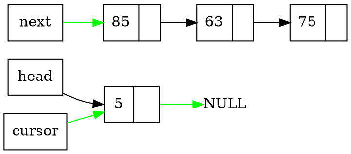
將原本指向 node 5 的 head 改為指到下一個 node ，讓 head 可以不斷往前。
```cpp=7
head = next;
```
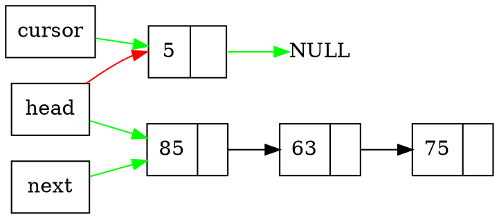
拿掉已經刪除的線
```graphviz
digraph foo{
    node [shape="record"]
    rankdir=LR;
    head [shape=box, label="head"];
    cursor [shape=box, label="cursor"];
    next [shape=box, label="next"];
    node0 [label="{<data> 5| <ref>}"];
    node1 [label="{<data> 85| <ref>}"];
    node2 [label="{<data> 63| <ref>}"];
    node3 [label="{<data> 75| <ref>}"];
    Null[shape=plain, label="NULL"]
    
    node1:ref -> node2:data;
    node2:ref -> node3:data;
    next -> node1 [color="green"];
    node0:ref -> Null [color="green"];
    cursor -> node0 [color="green"];
    head -> node1 [color="green"];
}
```
會發現 node 5 的 next 重新指向原本 cursor 所指。 head 逐漸往 list 尾端移動。
重複進行以上操作可以得到
```graphviz
digraph foo{
    node [shape="record"]
    rankdir=LR;
    head [shape=box, label="head"];
    cursor [shape=box, label="cursor"];
    next [shape=box, label="next"];
    node0 [label="{<data> 5| <ref>}"];
    node1 [label="{<data> 85| <ref>}"];
    node2 [label="{<data> 63| <ref>}"];
    node3 [label="{<data> 75| <ref>}"];
    Null[shape=plain, label="NULL"]
    
    node1:ref -> node0:data;
    node2:ref -> node1:data [color="green"];
    next -> node3 [color="green"];
    node0:ref -> Null;
    cursor -> node2 [color="green"];
    head -> node3 [color="green"];
}
```

```graphviz
digraph foo{
    node [shape="record"]
    rankdir=LR;
    head [shape=box, label="head"];
    cursor [shape=box, label="cursor"];
    next [shape=box, label="next"];
    node0 [label="{<data> 5| <ref>}"];
    node1 [label="{<data> 85| <ref>}"];
    node2 [label="{<data> 63| <ref>}"];
    node3 [label="{<data> 75| <ref>}"];
    Null[shape=plain, label="NULL"]
    
    node1:ref -> node0:data;
    node2:ref -> node1:data;
    next -> Null [color="green"];
    node0:ref -> Null;
    cursor -> node3 [color="green"];
    head -> node3 [color="green"];
    node3 -> node2  [color="green"];
}
```
最後因為 `head = next;` 因此 head 變為 Null ，因此結束迴圈，最終 cursor 變為新的 head。

## Rewrite with pointer of pointer style
以 `pointer of pointer` 重新實作 `swap_pair()` 與 `reverse()` 程式碼。

### indirect_swap()
- 程式碼：
```cpp=
void indirect_swap(node_t **node){
    for (;*node && (*node)->next; node = &(*node)->next->next){
        node_t *tmp = *node;
        *node = (*node)->next;
        tmp->next = (*node)->next;
        (*node)->next = tmp;
    }
}
```
- 概念大致與 `swap_pair()` 大致相同，差別在於省去 for 迴圈初始化的部分 `node_t **node = &head;` ，取而代之的是，直接以pointer of pointer 的 `node_t **node` 作為參數，此時的 `*node` 即為 head 的內容，因此若修改 `*node` 外部 head 也會隨之改變。
- 其餘 swap 部分的互換方式與 `swap_pair()` 皆相同，可參考 [swap_pair()的解釋](https://hackmd.io/oSo9qqNPS_-ioSXJpfdGPQ?both#Func4-swap_pair)

### indirect_reverse()
- 程式碼：
```cpp=
void indirect_reverse(node_t **node){
    node_t *pre = NULL;
    while((*node)->next){
        node_t *next = (*node)->next;
        (*node)->next = pre;
        pre = *node;
        *node = next;
    }
    (*node)->next = pre;
}
```
- 初始狀態：此時 head 與 `*node` 皆指向第一個 node(node 5)
- 用一個額外的 pointer 紀錄前一個 node (pre) ，因為當 `*node` 往後移動後，就沒辦法再取得前一個的 address (因為是單向的list)
```graphviz
digraph foo{
    node [shape="record"]
    rankdir=LR;
    head [shape=box, label="head\n(*node)"];
    indirect [shape=box, label="node"];   
    pre [shape=box, label="pre"];
    node0 [label="{<data> 5| <ref>}"];
    node1 [label="{<data> 85| <ref>}"];
    node2 [label="{<data> 63| <ref>}"];
    node3 [label="{<data> 75| <ref>}"];
    Null[shape=plain, label="NULL"]
    
    node0:ref -> node1:data;
    node1:ref -> node2:data;
    node2:ref -> node3:data;
    head -> node0:data;
    
    indirect->head;
    pre->Null;
}
```

- 首先，以 `next` 紀錄下一個 node 的 address ，因為待會要修改目前 node ，也就是 `*node` 的 next ，如果不先記錄下來，修改完 `(*node)->next` 之後，就會移失下一個 node 。
- 修改 `(*node)->next` 變成前一個 node 的 address 。
```cpp=4
node_t *next = (*node)->next;
(*node)->next = pre;
```
```graphviz
digraph foo{
    node [shape="record"]
    rankdir=LR;
    head [shape=box, label="head\n(*node)"];
    indirect [shape=box, label="node"];   
    pre [shape=box, label="pre"]; 
    next [shape=box, label="next"];
    node0 [label="{<data> 5| <ref>}"];
    node1 [label="{<data> 85| <ref>}"];
    node2 [label="{<data> 63| <ref>}"];
    node3 [label="{<data> 75| <ref>}"];
    Null[shape=plain, label="NULL"]
    
    node0:ref -> node1:data[color=red];
    node1:ref -> node2:data;
    node2:ref -> node3:data;
    head -> node0:data;
    
    indirect->head;
    pre->Null;
    
    next->node1[color=green];
    node0:ref -> Null[color=green];
}
```

- 更新 pre 的內容，下一次的 pre 就是目前的 node 。
- `*node` 移動到下一個 node
```cpp=6
pre = *node;
*node = next;
```
```graphviz
digraph foo{
    node [shape="record"]
    rankdir=LR;
    indirect [shape=box, label="node"];   
    pre [shape=box, label="pre"]; 
    next [shape=box, label="next"];
    node0 [label="{<data> 5| <ref>}"];
    node1 [label="{<data> 85\n(*node)| <ref>}"];
    node2 [label="{<data> 63| <ref>}"];
    node3 [label="{<data> 75| <ref>}"];
    Null[shape=plain, label="NULL"]
    
    node1:ref -> node2:data;
    node2:ref -> node3:data;
    
    indirect->next;
    pre->node0[color=green];
    
    next->node1;
    node0:ref -> Null;
}
```
:::warning
注意 `*indirect` 就是 `head` 目前指向的位置，因此隨著 `*node` 推移，head 也自動變換。
:::

- 重複以上步驟，稍微快轉一下
```graphviz
digraph foo{
    node [shape="record"]
    rankdir=LR;
    indirect [shape=box, label="node"];   
    pre [shape=box, label="pre"]; 
    next [shape=box, label="next"];
    node0 [label="{<data> 5| <ref>}"];
    node1 [label="{<data> 85| <ref>}"];
    node2 [label="{<data> 63| <ref>}"];
    node3 [label="{<data> 75\n(*node)| <ref>}"];
    Null[shape=plain, label="NULL"]
    
    node1:ref -> node0:data;
    node2:ref -> node1:data;
    
    indirect->next;
    pre->node2[color=green];
    
    next->node3;
    node0:ref -> Null;
}
```
- 此時到最後一個 node `(*node)->next` 為 NULL ，因此跳出迴圈。
- 最後需要重新指向最後一個 node (也是 head)的 next 。
```cpp=9
(*node)->next = pre;
```
```graphviz
digraph foo{
    node [shape="record"]
    rankdir=LR;
    indirect [shape=box, label="node"];   
    pre [shape=box, label="pre"]; 
    next [shape=box, label="next"];
    node0 [label="{<data> 5| <ref>}"];
    node1 [label="{<data> 85| <ref>}"];
    node2 [label="{<data> 63| <ref>}"];
    node3 [label="{<data> 75\n(*node)| <ref>}"];
    Null[shape=plain, label="NULL"]
    
    node1:ref -> node0:data;
    node2:ref -> node1:data;
    
    indirect->next;
    pre->node2;
    
    next->node3;
    node0:ref -> Null;
    node3:ref->node2[color=green];
}
```
然後就大功告成囉。

## Rewrite `reverse()` with recursive function

```cpp=
void rev_reverse(node_t *pre, node_t **node){
    if (!(*node)->next){
        (*node)->next = pre;
        return;
    }
    node_t *now = *node;
    *node = (*node)->next;
    rev_reverse(now, node);
    now->next = pre;
}

void rev_reverse_caller(node_t **head){
    rev_reverse(NULL, head);
}
```
- 使用 `rev_reverse_caller(node_t **head)` 更新 next 的內容。
    - 輸入：
        - 前一個 node 的 address
        - 目前的 head
    - 功能：
        - 如果下一個 node 的 next 仍然存在，更新下一個 node 的 next
        - 更新完下一個 node 之後，再更新自己的 node

```graphviz
digraph foo{
    node [shape="record"]
    rankdir=LR;
    head [shape=box, label="head\n(*node)"];
    node0 [label="{<data> 5| <ref>}"];
    node1 [label="{<data> 85| <ref>}"];
    node2 [label="{<data> 63| <ref>}"];
    node3 [label="{<data> 75| <ref>}"];
    Null[shape=plain, label="NULL"]
    
    node0:ref -> node1:data;
    node1:ref -> node2:data;
    node2:ref -> node3:data;
    head -> node0:data;
}
```
- 第一次 recursive
```graphviz
digraph foo{
    node [shape="record"]
    rankdir=LR;
    head [shape=box, label="head\n(*node)"];
    node0 [label="{<data> 5| <ref>}"];
    node1 [label="{<data> 85| <ref>}"];
    node2 [label="{<data> 63| <ref>}"];
    node3 [label="{<data> 75| <ref>}"];
    Null[shape=plain, label="NULL"]
    
    now1->node0[color=green];
    pre1->Null[color=green];
    
    node0:ref -> node1:data;
    node1:ref -> node2:data;
    node2:ref -> node3:data;
    head -> node0:data;
}
```
- 第二次 recursive
```graphviz
digraph foo{
    node [shape="record"]
    rankdir=LR;
    head [shape=box, label="head"];
    node0 [label="{<data> 5| <ref>}"];
    node1 [label="{<data> 85\n(*node)| <ref>}"];
    node2 [label="{<data> 63| <ref>}"];
    node3 [label="{<data> 75| <ref>}"];
    Null[shape=plain, label="NULL"]
    
    now1->node0[color=green];
    pre1->Null[color=green];
    
    now2->node1[color=green];
    pre2->node0[color=green];
    
    node0:ref -> node1:data;
    node1:ref -> node2:data;
    node2:ref -> node3:data;
    head -> node0:data;
}
```
- 第二次 recursive
```graphviz
digraph foo{
    node [shape="record"]
    rankdir=LR;
    node0 [label="{<data> 5| <ref>}"];
    node1 [label="{<data> 85| <ref>}"];
    node2 [label="{<data> 63\n(*node)| <ref>}"];
    node3 [label="{<data> 75| <ref>}"];
    Null[shape=plain, label="NULL"]
    
    now1->node0[color=green];
    pre1->Null[color=green];
    
    now2->node1[color=green];
    pre2->node0[color=green];
    
    now3->node2[color=green];
    pre3->node1[color=green];
    
    node0:ref -> node1:data;
    node1:ref -> node2:data;
    node2:ref -> node3:data;
}
```
- 第三次 recursive
```graphviz
digraph foo{
    node [shape="record"]
    rankdir=LR;
    node0 [label="{<data> 5| <ref>}"];
    node1 [label="{<data> 85| <ref>}"];
    node2 [label="{<data> 63| <ref>}"];
    node3 [label="{<data> 75\n(*node)| <ref>}"];
    Null[shape=plain, label="NULL"]
    
    now1->node0[color=green];
    pre1->Null[color=green];
    
    now2->node1[color=green];
    pre2->node0[color=green];
    
    now3->node2[color=green];
    pre3->node1[color=green];
    
    now4->node3[color=green];
    pre4->node2[color=green];
    
    node0:ref -> node1:data;
    node1:ref -> node2:data;
    node2:ref -> node3:data;
}
```
- 現在 `(*node)->next` 為 Null ，因此滿足離開條件，不再 recursive
- 將最後一個 node 的 next 接回去 pre 也就是 node 63
```cpp=2
if (!(*node)->next){
    (*node)->next = pre;
    return;
}
```
```graphviz
digraph foo{
    node [shape="record"]
    rankdir=LR;
    node0 [label="{<data> 5| <ref>}"];
    node1 [label="{<data> 85| <ref>}"];
    node2 [label="{<data> 63| <ref>}"];
    node3 [label="{<data> 75\n(*node)| <ref>}"];
    Null[shape=plain, label="NULL"]
    
    now1->node0;
    pre1->Null;
    
    now2->node1;
    pre2->node0;
    
    now3->node2;
    pre3->node1;
    
    "*node"->node3;
    pre->node2;
    
    node3:ref->node2:data[color=green];
    
    node0:ref -> node1:data;
    node1:ref -> node2:data;
    node2:ref -> node3:data;
}
```
一個一個回去， now3 的 next 指向 pre3
```graphviz
digraph foo{
    node [shape="record"]
    rankdir=LR;
    node0 [label="{<data> 5| <ref>}"];
    node1 [label="{<data> 85| <ref>}"];
    node2 [label="{<data> 63| <ref>}"];
    node3 [label="{<data> 75\n(*node)| <ref>}"];
    Null[shape=plain, label="NULL"]
    
    now1->node0;
    pre1->Null;
    
    now2->node1;
    pre2->node0;
    
    now3->node2;
    pre3->node1;
    
    node3:ref->node2:data;
    node2:ref->node1:data[color=green];
    
    node0:ref -> node1:data;
    node1:ref -> node2:data;
    node2:ref -> node3:data[color=red];
}
```
now2 的 next 指向 pre2
```graphviz
digraph foo{
    node [shape="record"]
    rankdir=LR;
    node0 [label="{<data> 5| <ref>}"];
    node1 [label="{<data> 85| <ref>}"];
    node2 [label="{<data> 63| <ref>}"];
    node3 [label="{<data> 75\n(*node)| <ref>}"];
    Null[shape=plain, label="NULL"]
    
    now1->node0;
    pre1->Null;
    
    now2->node1;
    pre2->node0;
    
    node3:ref->node2;
    node2:ref->node1:data;
    node1:ref->node0:data[color=green];
    
    node0:ref -> node1:data;
    node1:ref -> node2:data[color=red];
}
```
now1 的 next 指向 pre1
```graphviz
digraph foo{
    node [shape="record"]
    rankdir=LR;
    node0 [label="{<data> 5| <ref>}"];
    node1 [label="{<data> 85| <ref>}"];
    node2 [label="{<data> 63| <ref>}"];
    node3 [label="{<data> 75\n(*node)| <ref>}"];
    Null[shape=plain, label="NULL"]
    
    now1->node0;
    pre1->Null;
    
    node3:ref->node2:data;
    node2:ref->node1:data;
    node1:ref->node0:data;
    node0:ref->Null[color=green];
    
    node0:ref -> node1:data[color=red];
}
```
最終
```graphviz
digraph foo{
    node [shape="record"]
    rankdir=LR;
    node0 [label="{<data> 5| <ref>}"];
    node1 [label="{<data> 85| <ref>}"];
    node2 [label="{<data> 63| <ref>}"];
    node3 [label="{<data> 75\n(*node)| <ref>}"];
    Null[shape=plain, label="NULL"]
    
    node3:ref->node2;
    node2:ref->node1;
    node1:ref->node0;
    node0:ref->Null;
}
```

## Fisher–Yates shuffle

### Brief description of `Fisher–Yates shuffle`

這是一個用來打亂 link list 的演算法，藉由隨機抽取 list 中的節點(抽過不可再抽)，取得隨機的抽籤順序，形成的抽籤順序即為 shuffle 過的 list。

### Modern Algorithm
假設一開始的 list 長這樣：
```graphviz
digraph foo{
    node [shape="record"]
    rankdir=LR;
    n [label="{<n0>0|<n1>1|<n2>2|<n3>3|<n4>4|<n5>5|<n6>6|<n7>7}"];
    c [label="count=7"];
    
}
```
現在開始隨機抽一個，假設抽到3，拿3和 `count` 互換，換完之後  count 減一。
```graphviz
digraph foo{
    node [shape="record"]
    rankdir=LR;
    n [label="{<n0>0|<n1>1|<n2>2|<n3>3|<n4>4|<n5>5|<n6>6|<n7>7}"];
    n:n3->n:n7[dir=both, tailclip=false, headclip=false];
    c [label="count=7"];
    
}
```
再抽一個5
```graphviz
digraph foo{
    node [shape="record"]
    rankdir=LR;
    n [label="{<n0>0|<n1>1|<n2>2|<n3>7|<n4>4|<n5>5|<n6>6|<n7>3}"];
    n:n5->n:n6[dir=both, tailclip=false, headclip=false];
    c [label="count=6"];
    
}
```
再抽一個2
```graphviz
digraph foo{
    node [shape="record"]
    rankdir=LR;
    n [label="{<n0>0|<n1>1|<n2>2|<n3>7|<n4>4|<n5>6|<n6>5|<n7>3}"];
    n:n2->n:n5[dir=both, tailclip=false, headclip=false];
    c [label="count=5"];
    
}
```
再抽一個0
```graphviz
digraph foo{
    node [shape="record"]
    rankdir=LR;
    n [label="{<n0>0|<n1>1|<n2>6|<n3>7|<n4>4|<n5>2|<n6>5|<n7>3}"];
    n:n0->n:n4[dir=both, tailclip=false, headclip=false];
    c [label="count=4"];
    
}
```
再抽一個3
```graphviz
digraph foo{
    node [shape="record"]
    rankdir=LR;
    n [label="{<n0>4|<n1>1|<n2>6|<n3>7|<n4>0|<n5>2|<n6>5|<n7>3}"];
    n:n3->n:n3[dir=both, tailclip=false, headclip=false];
    c [label="count=3"];
    
}
```
再抽一個1
```graphviz
digraph foo{
    node [shape="record"]
    rankdir=LR;
    n [label="{<n0>4|<n1>1|<n2>6|<n3>7|<n4>0|<n5>2|<n6>5|<n7>3}"];
    n:n1->n:n2[dir=both, tailclip=false, headclip=false];
    c [label="count=2"];
    
}
```
再抽一個1
```graphviz
digraph foo{
    node [shape="record"]
    rankdir=LR;
    n [label="{<n0>4|<n1>1|<n2>6|<n3>7|<n4>0|<n5>2|<n6>5|<n7>3}"];
    n:n1->n:n1[dir=both, tailclip=false, headclip=false];
    c [label="count=1"];
    
}
```
大功告成囉!

程式碼：
```cpp=
int length(node_t *head){
    int l=0;
    while(head){
        l++;
        head = head->next;
    }
    return l;
}

void swap_value(node_t *node1, node_t *node2){
    int tmp = node2->value;
    node2->value = node1->value;
    node1->value = tmp;
}

void shuffle(node_t *head){
    srand(time(NULL));
    int len = length(head);
    for(int i=0; i<len; i++){
        int random = rand() % (len - i);
        node_t *target = head;
        for (int j=0; j<random; j++)
            target = target->next;
        swap_value(head, target);
        head = head->next;
    }
}
```
- 利用 `length()` 計算 list 長度。
- 利用 `swap_value()` 交換 node 的內容。
- 由於本例的 list 是單向的，相較於原本演算法是與最後一個元素交換，採取與最前面的元素交換，使得交換的順序與 next 的方向一致。

使用方法：
```cpp=
int main(int argc, char const *argv[])
{
    node_t *head = NULL;

    print_list(head);

    add_entry(&head, 72);
    add_entry(&head, 101);
    add_entry(&head, 108);
    add_entry(&head, 109);
    add_entry(&head, 110);
    add_entry(&head, 111);
    print_list(head);
    
    shuffle(head);
    print_list(head);

    return 0;
}